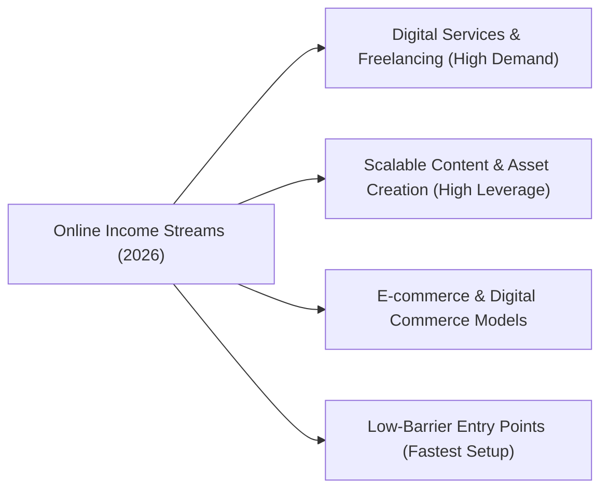

# Comprehensive Guide: Best Ways to Make Money Online in 2026

This expanded list categorises the most viable online revenue streams for 2026 based on business models, skill requirements, and leverage.

---

## 🗺️ Visual Ecosystem Overview

---

## 1. Digital Services & Freelancing (High Demand)

*   **AI Integration & Automation Consulting:** Businesses are desperate to integrate AI into their daily workflows. You can build customized AI chatbots, set up automated workflows using tools like Make or Zapier, or train small business teams on how to leverage generative AI.
*   **Performance Ad Consulting:** Managing paid customer acquisition campaigns across Meta, Google, YouTube, and TikTok. E-commerce brands willingly pay high retainers to experts who can generate a measurable return on investment (ROI).
*   **Short-Form Video Editing (Clipping):** Repurposing long-form podcasts, livestreams, and webinars into highly engaging shorts, reels, and TikToks. This is a massive market for businesses looking to build a social media presence without creating raw footage from scratch.
*   **Niche Copywriting & Social Media Ghostwriting:** Writing targeted content like automated email sequences, high-converting landing pages, or thought-leadership posts on professional platforms like LinkedIn and X. 
*   **Web & App Development:** Building intelligent, resilient, and user-focused digital platforms. While no-code website builders handle basic layouts, specialized developers are highly compensated to build custom features, optimize database architectures, or integrate advanced APIs.

---

## 2. Scalable Content & Asset Creation (High Leverage)

*   **Selling Digital Products & Templates:** Designing reusable digital resources like complex Notion dashboards, custom spreadsheet templates, website design themes, or digital planners. Once created, these products cost nothing to replicate and can be sold globally.
*   **Faceless Content Channels:** Building an audience on YouTube or TikTok using voiceovers, stock footage, and animations rather than appearing on camera. These channels monetize heavily through the platforms' creator funds, sponsorships, and targeted affiliate links.
*   **Paid Newsletters & Communities:** Launching a subscription-based community or newsletter on platforms like Substack or Whop. Delivering highly curated, industry-specific data or building private networking hubs creates a steady stream of recurring revenue.
*   **Online Education & Cohort Courses:** Packaging your deep professional expertise or a complex technical skill into an online course or multi-week live boot camp.

---

## 3. E-commerce & Digital Commerce Models

*   **Niche Print-on-Demand (POD):** Partnering with suppliers like Printify to print custom artwork or niche typography onto apparel, mugs, and home decor only after a customer makes a purchase. This eliminates upfront inventory costs.
*   **Curated Subscription Boxes:** Launching a recurring delivery service for highly specialized or artisanal physical products. Focusing on hyper-focused subcultures (e.g., specific hobbyist gear or unique regional snacks) ensures a high customer lifetime value.
*   **Digital Asset Flipping:** Buying underperforming niche websites, software applications, or premium domain names, optimizing their design, SEO, and monetization strategies, and then reselling them for a profit.

---

## 4. Low-Barrier Entry Points (Fastest Setup)

*   **User-Generated Content (UGC) Creation:** Creating authentic, smartphone-shot product reviews or unboxing videos for brands to use in their paid advertising campaigns. You don't need a large social media following, as the brands host the videos on their own channels.
*   **Remote Online Tutoring:** Teaching academic subjects, languages, or coding to international students through structured digital platforms like Preply or Wyzant.
*   **Virtual Assistant (VA) Services:** Providing administrative support, managing calendar scheduling, sorting client emails, or executing basic data entry tasks for busy executives or online business owners.

