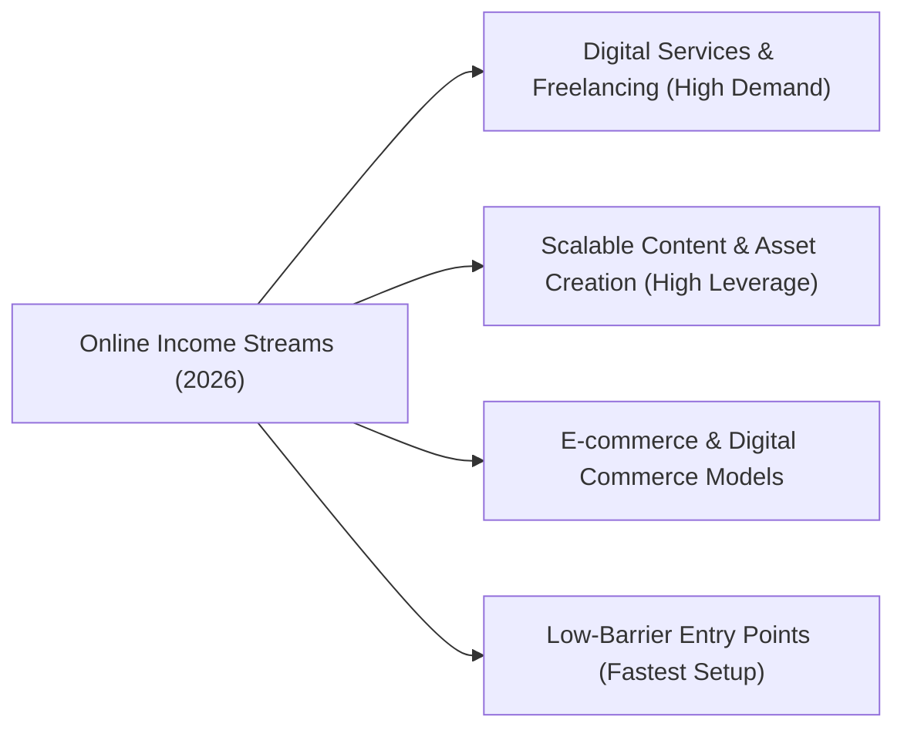

# Comprehensive Guide: Best Ways to Make Money Online in 2026

This expanded list categorises the most viable online revenue streams for 2026 based on business models, skill requirements, and leverage.

---

## 🗺️ Visual Ecosystem Overview

---

## 📊 Executive Overview: Top Online Income Streams (2026)

| 🏷️ Category | 🎯 Core Focus | ⚡ Leverage Level | ⏳ Time to First Dollar | 📄 Key Foundational Reference |
| :--- | :--- | :---: | :---: | :--- |
| **Digital Services & Freelancing** | High-ticket custom solutions & AI automation | Medium | 1–3 Weeks | [Chen et al. (2021) / arXiv](https://arxiv.org/abs/2107.03374) |
| **Scalable Content & Assets** | Digital goods, community subscriptions & media | Very High | 1–3 Months | [Bakos & Brynjolfsson (1999)](https://doi.org/10.1287/mnsc.45.12.1613) |
| **E-commerce & Digital Commerce** | POD merchandise, subscription commerce & flipping | High | 2–4 Weeks | [Pine (1993) / HBR](https://hbr.org/1993/01/making-mass-customization-work) |
| **Low-Barrier Entry Points** | UGC videos, 1-on-1 tutoring & executive VA | Fast Setup | 1–7 Days | [Kietzmann et al. (2011)](https://doi.org/10.1016/j.bushor.2011.01.005) |

---

## 1. Digital Services & Freelancing (High Demand)

| 💼 Revenue Stream | 📝 Description & 2026 Strategy | 📅 Year First Used | 📄 Foundational Paper / Benchmark | 🔗 Detailed Guide |
| :--- | :--- | :---: | :--- | :---: |
| **AI Integration & Automation Consulting** | Build customized LLM agents, RAG architectures, and workflow automations (Zapier, Make) for SMEs. | 2022 | [Yao et al. (2022) / ReAct](https://arxiv.org/abs/2210.03629) | [Details](pages/ai-integration-consulting.md) |
| **Performance Ad Consulting** | Manage multi-channel customer acquisition (Meta, Google, TikTok) optimizing ROAS with AI creative testing. | 2002 | [Edelman et al. (2007) / NBER](https://www.nber.org/papers/w11765) | [Details](pages/performance-ad-consulting.md) |
| **Short-Form Video Editing (Clipping)** | Repurpose long-form podcasts and livestreams into viral Shorts, Reels, and TikTok clips using AI captions and cuts. | 2020 | [Narasimhan et al. (2021) / CLIP-It](https://arxiv.org/abs/2104.08860) | [Details](pages/short-form-video-editing.md) |
| **Niche Copywriting & Ghostwriting** | Write automated email sequences, landing pages, and LinkedIn/X executive ghostwriting leveraging generative LLMs. | 2020 | [Brown et al. (2020) / Few-Shot](https://arxiv.org/abs/2005.14165) | [Details](pages/niche-copywriting-ghostwriting.md) |
| **Web & App Development** | Architect modern web apps, full-stack micro-SaaS, and API integrations with modern frameworks. | 1990 | [Chen et al. (2021) / Codex Code LLMs](https://arxiv.org/abs/2107.03374) | [Details](pages/web-app-development.md) |

---

## 2. Scalable Content & Asset Creation (High Leverage)

| 💼 Revenue Stream | 📝 Description & 2026 Strategy | 📅 Year First Used | 📄 Foundational Paper / Benchmark | 🔗 Detailed Guide |
| :--- | :--- | :---: | :--- | :---: |
| **Selling Digital Products & Templates** | Create reusable Notion systems, UI kits, spreadsheet tools, and digital planners with zero marginal replication cost. | 1999 | [Bakos & Brynjolfsson (1999) / Bundling](https://doi.org/10.1287/mnsc.45.12.1613) | [Details](pages/selling-digital-products.md) |
| **Faceless Content Channels** | Run YouTube/TikTok niche channels using synthetic voiceover, stock B-roll, and algorithmic storytelling. | 2020 | [Kong et al. (2020) / HiFi-GAN](https://arxiv.org/abs/2006.04558) | [Details](pages/faceless-content-channels.md) |
| **Paid Newsletters & Communities** | Monetize curated industry insights and private communities via Substack, Beehiiv, and Whop. | 1998 | [Shapiro & Varian (1998) / Info Rules](https://doi.org/10.1016/S0304-4076(99)00018-9) | [Details](pages/paid-newsletters-communities.md) |
| **Online Education & Cohort Courses** | Package deep domain knowledge into interactive cohort bootcamps, workshops, and video masterclasses. | 2008 | [Siemens & Downes (2008) / Connectivism](https://er.educause.edu/articles/2008/10/connectivism-a-learning-theory-for-the-digital-age) | [Details](pages/online-education-cohort-courses.md) |

---

## 3. E-commerce & Digital Commerce Models

| 💼 Revenue Stream | 📝 Description & 2026 Strategy | 📅 Year First Used | 📄 Foundational Paper / Benchmark | 🔗 Detailed Guide |
| :--- | :--- | :---: | :--- | :---: |
| **Niche Print-on-Demand (POD)** | Partner with on-demand fulfillment (Printify, Gelato) for niche apparel and home decor with zero upfront inventory. | 1993 | [Pine (1993) / Mass Customization](https://hbr.org/1993/01/making-mass-customization-work) | [Details](pages/niche-print-on-demand.md) |
| **Curated Subscription Boxes** | Deliver recurring themed physical goods for passionate hobbyists and micro-communities. | 2001 | [Biyalogorsky et al. (2001) / Retention](https://doi.org/10.1509/jmkg.65.2.82.18253) | [Details](pages/curated-subscription-boxes.md) |
| **Digital Asset Flipping** | Acquire undervalued niche websites, newsletter lists, and micro-SaaS, improve SEO/monetization, and resell for profit. | 2001 | [Kauffman & Wang (2001) / Valuation](https://doi.org/10.1080/10864415.2001.11044230) | [Details](pages/digital-asset-flipping.md) |

---

## 4. Low-Barrier Entry Points (Fastest Setup)

| 💼 Revenue Stream | 📝 Description & 2026 Strategy | 📅 Year First Used | 📄 Foundational Paper / Benchmark | 🔗 Detailed Guide |
| :--- | :--- | :---: | :--- | :---: |
| **User-Generated Content (UGC) Creation** | Shoot authentic organic-style short video ads and product reviews for direct-to-consumer brand campaigns. | 2011 | [Kietzmann et al. (2011) / Social Media](https://doi.org/10.1016/j.bushor.2011.01.005) | [Details](pages/ugc-creation.md) |
| **Remote Online Tutoring** | Provide personalized online 1-on-1 instruction in academic topics, coding, or languages via global platforms. | 2011 | [VanLehn (2011) / Tutoring Effectiveness](https://doi.org/10.1080/00461520.2011.611777) | [Details](pages/remote-online-tutoring.md) |
| **Virtual Assistant (VA) Services** | Offer specialized executive administrative support, inbox/calendar management, and customer workflow operations. | 2004 | [Malone (2004) / Future of Work](https://mitpress.mit.edu/9780262633215/the-future-of-work/) | [Details](pages/virtual-assistant-services.md) |

