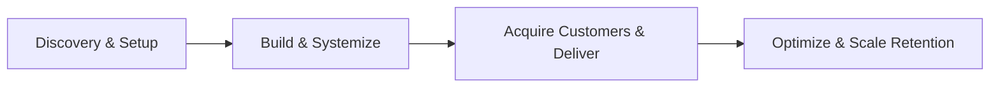
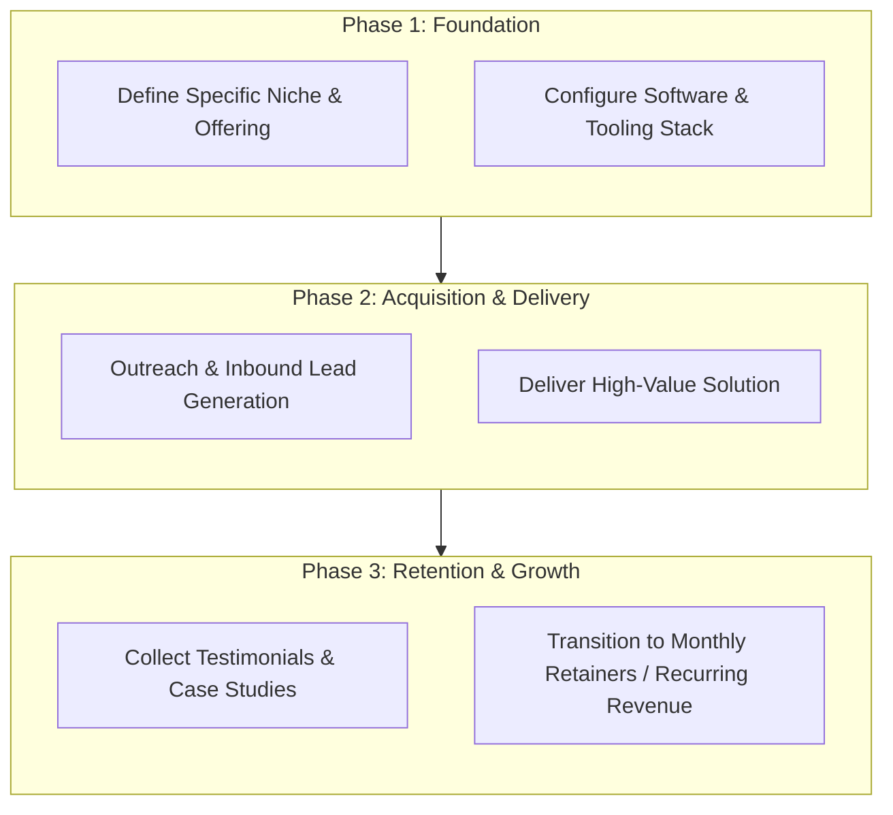

# 🚀 Faceless Content Channels

> 📚 Part of the **[Comprehensive Guide: Best Ways to Make Money Online in 2026](../README.md)**  
> 🏷️ **Category:** Scalable Content & Asset Creation

---

## 🌟 Strategic Overview & Opportunity

Run automated video channels using voice synthesis and stock footage. In 2026, leveraging generative AI workflows, hyper-targeted distribution, and automated tooling allows individual operators and boutique agencies to generate substantial cash flow with minimal upfront overhead.

---

## 🔄 Execution Architecture & Operational Workflow

---

## 🛠️ Essential SaaS Products & Tech Stack

Below is the verified software ecosystem for executing this business model in 2026:

| Tool / Platform | Category | Pricing & Plans | Free Tier Limits |
| :--- | :--- | :--- | :--- |
| **ElevenLabs** | AI Voice Cloning | Starter: $5/mo, Creator: $22/mo | 10,000 chars/month free |
| **Storyblocks** | Stock Media | Unlimited: $65/mo | Preview only (no permanent free downloads) |
| **Midjourney** | AI Imagery | Basic: $10/mo, Standard: $30/mo | Paid only (no free trial) |
| **VidIQ** | YouTube SEO | Pro: $10/mo, Boost: $49/mo | Basic keyword search free |

---

## 📋 Step-by-Step Implementation Roadmap

1. **Phase 1 (Days 1–7): Setup & Positioning**
   - Define your unique value proposition and target client/customer persona.
   - Establish digital assets, portfolio samples, and automated scheduling links.
2. **Phase 2 (Days 8–21): Outbound Sprint & Pipeline Building**
   - Execute focused outbound messaging and publish organic case studies.
   - Run initial pilot projects or discovery consultations.
3. **Phase 3 (Days 22–30): Delivery & Quality Assurance**
   - Deploy standard operating procedures (SOPs) and AI-assisted workflows.
   - Gather feedback and iterate on product/service delivery.
4. **Phase 4 (Ongoing): Systems Scaling & Retainers**
   - Upsell satisfied clients to monthly retainers or recurring subscriptions.
   - Automate operational overhead using webhooks and scheduled jobs.

---

## 💰 Monetization & Earnings Potential

- **Total Industry Market Size (2026):** `~$30 Billion in synthetic media & automated creator ad monetization`
- **Estimated Individual Earning Potential:** `$3,000 - $30,000/mo`
- **Profit Margins:** Typically **70%–95%** for digital services and information assets.
- **Time to First Revenue:** Typically 1 to 4 weeks with dedicated execution.

---

## 🔗 Related Resources & Navigation

- 🏠 **[Return to Main Guide](../README.md)**
- 💡 **[Awesome Repository Hub](https://github.com/ishandutta2007/Awesome-Awesome-Awesome)**
- 💬 **[Join Creator Community Discord](https://discord.gg/jc4xtF58Ve)**
