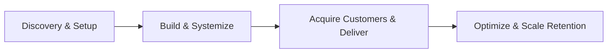
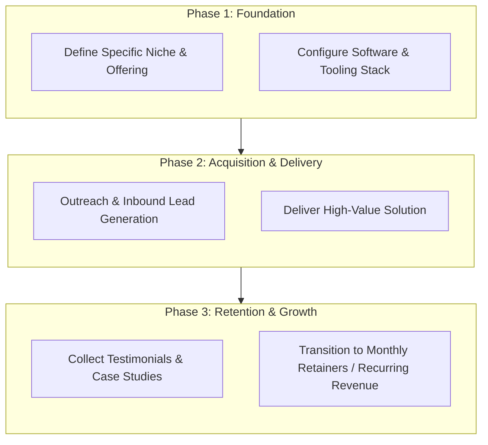

# 🚀 Paid Newsletters & Communities

> 📚 Part of the **[Comprehensive Guide: Best Ways to Make Money Online in 2026](../README.md)**  
> 🏷️ **Category:** Scalable Content & Asset Creation

---

## 🌟 Strategic Overview & Opportunity

Publish curated industry insights and host private mastermind hubs. In 2026, leveraging generative AI workflows, hyper-targeted distribution, and automated tooling allows individual operators and boutique agencies to generate substantial cash flow with minimal upfront overhead.

---

## 🔄 Execution Architecture & Operational Workflow

---

## 🛠️ Essential SaaS Products & Tech Stack

Below is the verified software ecosystem for executing this business model in 2026:

| Tool / Platform | Category | Pricing & Plans | Free Tier Limits |
| :--- | :--- | :--- | :--- |
| **Beehiiv** | Newsletter SaaS | Scale: $39/mo, Max: $99/mo | Free up to 2,500 subscribers |
| **Substack** | Newsletter Platform | 10% fee on paid subs | Free unlimited free subscribers |
| **Whop** | Digital Marketplace | 3% transaction fee | Free setup (no monthly fees) |
| **Skool** | Community Hub | Flat $99/month | 14-day free trial |

---

## 📋 Step-by-Step Implementation Roadmap

1. **Phase 1 (Days 1–7): Setup & Positioning**
   - Define your unique value proposition and target client/customer persona.
   - Establish digital assets, portfolio samples, and automated scheduling links.
2. **Phase 2 (Days 8–21): Outbound Sprint & Pipeline Building**
   - Execute focused outbound messaging and publish organic case studies.
   - Run initial pilot projects or discovery consultations.
3. **Phase 3 (Days 22–30): Delivery & Quality Assurance**
   - Deploy standard operating procedures (SOPs) and AI-assisted workflows.
   - Gather feedback and iterate on product/service delivery.
4. **Phase 4 (Ongoing): Systems Scaling & Retainers**
   - Upsell satisfied clients to monthly retainers or recurring subscriptions.
   - Automate operational overhead using webhooks and scheduled jobs.

---

## 💰 Monetization & Earnings Potential

- **Estimated Earning Potential:** `$5,000 - $25,000/mo MRR`
- **Profit Margins:** Typically **70%–95%** for digital services and information assets.
- **Time to First Revenue:** Typically 1 to 4 weeks with dedicated execution.

---

## 🔗 Related Resources & Navigation

- 🏠 **[Return to Main Guide](../README.md)**
- 💡 **[Awesome Repository Hub](https://github.com/ishandutta2007/Awesome-Awesome-Awesome)**
- 💬 **[Join Creator Community Discord](https://discord.gg/jc4xtF58Ve)**
